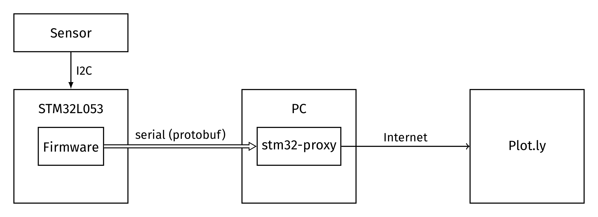

Using a cheap STM32 Nucleo to teach remote sensor monitoring.
-------------------------------------------------------------

One of the major struggles as a University professor is to create
compelling examples for introductory courses to computer science. You
either end up with sterile toys, or bigger but hardly reusable examples.

Part of my students are enrolled in the Energetic Engineering track, so
I thought that it would be great to show them an example of embedded
system in that application domain.

In this small post, I'll sum up how I've built an embedded system for
temperature monitoring that sends data to an online plotting service
[Plot.ly](https://plot.ly).

Hardware
========

For this tutorial, I'll use an an [ST Nucleo
L053R8](https://developer.mbed.org/platforms/ST-Nucleo-L053R8/) as a
main board and a
[X-NUCLEO-IKS01A1Motion](http://www.st.com/web/catalog/tools/FM116/SC1248/PF261191)
sensor shield for measuring room temperature. For the remote connection,
I am going to use the PC as a bridge, by using a small custom proxy to
forward data to the remote service. As a future step, this can be
substituted by a wifi shield, to make the system completely autonomous.


Both boards can be bought at [Mouser](http://www2.mouser.com) for
approximately $26, so they are pretty cheap, even for a student. The
boards are also compatible with the Arduino eco-system so there is no
risk of vendor locking, in the case you want to take this experiment a
little bit further.

Interestingly, the mounted ARM Cortex M0 has only 64Kb of flash memory
for programs and 8Kb of data RAM. While not necessarily the most
resource constrained, this proved to be rather challenging for
exchanging structured data between the Cortex and the PC.

Enough words, gimme the code
----------------------------

Those impatient can checkout the source code used in this tutorial from
[GitHub](https://github.com/vzaccaria/stm32l053) - see the `example2`
directory.

Just `cd` into one of the `example*` directories; then, with the board
attached run `platform run`.

Software Architecture
=====================

The whole build system is based on [Platform
IO](http://platformio.org/#!/), a very interesting project that allows
to setup, build and execute embedded programs by downloading, on demand,
the appropriate toolchain for an ever growing set of boards.

PlatformIO is built on Python so it is suggested to create a virtual env
before the installation:

``` sh
virtualenv env
source ./env/bin/activate h
python -c "$(curl -fsSL https://raw.githubusercontent.com/platformio/platformio/master/scripts/get-platformio.py)"
```

Hardware architecture
=====================

The sensor shield is connected to the STM32 through a synchronous serial
interface (I2C). We are going to write a small firmware that sends
temperature data through the serial interface to the
[plotly](https://plot.ly/).

Ideally, we would send HTTP packets directly from the STM32 by relying
on a simple proxy-server; however, given the technical limitations of
the board we cannot afford any useful communication library. In fact, I
even tried compiling [picojson](https://github.com/kazuho/picojson) but
I ran out of space on the flash memory.

So I turned out to slightly different solution: using Google's
[protobuf](https://developers.google.com/protocol-buffers/) over the
serial interface and relaying packets through a Nodejs proxy:



Protobuf
--------

Protobuf is basically a nifty DSL to:

> easily write and read your structured data to and from a variety of
> data streams and using a variety of languages.

In our case, the prototype definition of the packet we want to send is
described by the following protobuf `.proto` file:

    message pct {
        required float temp_value_C = 1;
        required float hum_value = 2;
        required float pressure_value = 3;
        }

where each field is required and has a different numeric tag. These tags
are used to identify your fields in the message binary format, and
preserve the field's meanings over the evolution of your protocol.

Generating a suitable C serialization function is just as simple as:

``` shell
protoc-c --c_out=src proto/message.proto
```

After that, you'll find both a header and a function definition file to
be included in your project. The exported API is composed by the
following macros and functions are the one that we will use the most:

``` c
/* Default initialization literal for our packets */
#define PCT__INIT \
 { PROTOBUF_C_MESSAGE_INIT (&pct__descriptor) \
 , 0, 0, 0 }


/* Packs a Pct message into a generic byte buffer (out) */
size_t pct__pack (const Pct   *message,
                  uint8_t     *out);

/* As a means to synchronize the de-serialization, we need to
send packet size beforehand */
size_t pct__get_packed_size (const Pct   *message);
```

The Nodejs Proxy
----------------

For proxy-ing the requests coming from the USB we are going to use
`stm32-proxy`, a super-simple POST request proxy for micro-controllers.
You can get it from NPM:

    npm install stm32-proxy

The program parses a stream of packets specified by a `PROTO` file
through javascript plugin:

    Usage:
        stm32-proxy PROTO [ -p PORT ] [ -g PLUGIN ]
        stm32-proxy ( -h | --help )

    Options:
        -h, --help              help for stm32-proxy
        -p, --port PORT         port to use to connect to the stm32
        -g, --plugin PLUGIN     javascript plugin (implements init() and process(data))


    Arguments:
        PROTO                   prototype file

In our case, we are going to post-process packets through a
`plotly-stm32-proxy-plugin.js` which contains all the logic for sending
packets to our plotly account, by using the [`Plotly` Nodejs
package](https://www.npmjs.com/package/plotly). Basically, all the proxy
plugins should specify an `init` function (for setting up the
connectivity at the beginning) and a `process(packet)` function that is
invoked for each packet.

In our case, `process` sends packets to the Plotly stream connection `s`
as follows:

``` js
function process(m) {
      var datum = m.temp_value_C
      var dta = {
          x: $m().format('YYYY-MM-DD HH:mm:ss.SS'),
          y: datum
      }
      var payload = JSON.stringify(dta) + '\n'
      s.write(payload);
}
```

The STM32 program
-----------------

The firmware running on the STM32 is very simple; the main loop samples
the sensors every 200ms through `getSensorValues` and sends the values
to the stm32-proxy through the serial line (`sendData`):

``` c
while (true) {
    led1 = !led1;
    Pct m = PCT__INIT;
    getSensorValues(m);
    sendData(&m);
    Thread::wait(200);
}
```

Before that, however, we have to initialize the sensors shield through
the appropriate API. Here I am using the one exported by the
'x\_cube\_mems' library, which I have downloaded from the STM website.:

``` c
mems_expansion_board->hts221.Power_ON();
mems_expansion_board->hts221.HTS221_Calibration();
```

Getting sensor values into a `Pct` packet is as simple as (forgive me
for the use of lambdas in C++, but they are so nice):

``` c
auto getSensorValues = [&](Pct &m) {
mems_expansion_board->hts221.GetTemperature((float *)&m.temp_value_c);
mems_expansion_board->hts221.GetHumidity((float *)&m.hum_value);
mems_expansion_board->lps25h.GetPressure((float *)&m.pressure_value);
};
```

Sending data however is a bit trickier as (Google docs):

> The Protocol Buffer wire format is not self-delimiting, so protocol
> buffer parsers cannot determine where a message ends on their own.

To be able to synchronize to the beginning of a packet, we rely on a
sync [magic
word](https://en.wikipedia.org/wiki/Magic_number_(programming)) ('VZ')
followed by the length of the packet and by the payload itself.

We encode the length of the payload `m` by using a 4 byte integer:

``` c

union { unsigned char bytes[4]; uint32_t value; } o32_to_bytes;

...

auto len = pct__get_packed_size(m);

...

o32_to_bytes.value = len;
pc.printf("VZ");
for(uint i=0; i<4; i++) {
pc.printf("%c", o32_to_bytes.bytes[i]);
}
```

and then we send the payload `m` by first serializing it through the
`pct__pack` function provided by protobuf:

``` c
uint8_t buf[PCT_BUF_SIZE];
pct__pack(m, buf);
for(uint i=0; i<len; i++) {
    pc.printf("%c", buf[i]);
}
```

Finally online
--------------

To start up monitoring, we first compile and install the firmware through Platformio:

```
platformio run
```

and then launch the monitoring proxy to listen to our serial port:

```
./node_modules/.bin/stm32-proxy proto/message.proto -p '/dev/cu.usbmodemfa133' -g "`pwd`/tools/plotly-stm32-proxy-plugin.js"
```

If you go into your Plotly homepage you should see a live plot of the data sent by your
board (in this case only temperature):


